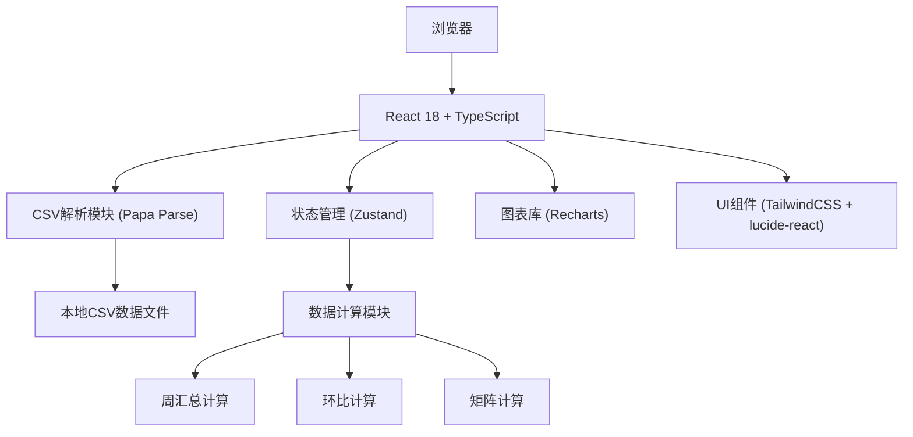

## 1. 架构设计

本项目为纯前端应用，数据来自本地CSV文件，无需后端服务。



## 2. 技术描述

- **前端框架**：React@18 + TypeScript@5 + Vite@5
- **初始化工具**：vite-init
- **样式方案**：TailwindCSS@3
- **状态管理**：Zustand@4
- **图表库**：Recharts@2
- **CSV解析**：Papa Parse@5
- **日期处理**：date-fns@3
- **图标**：lucide-react@0.344
- **后端**：无（纯前端应用）
- **数据库**：无（本地CSV文件）

## 3. 项目结构

```
src/
├── components/
│   ├── FilterBar.tsx          # 筛选器组件
│   ├── WeeklyBarChart.tsx     # 周汇总柱状图
│   ├── ComparisonTable.tsx    # 环比分析表
│   ├── TimeSlotMatrix.tsx     # 时段矩阵容器
│   ├── DateRangePicker.tsx    # 日期区间选择器
│   └── ExportButton.tsx       # 导出按钮
├── hooks/
│   ├── useCsvData.ts          # CSV数据加载Hook
│   └── useComplaintAnalysis.ts # 投诉数据分析Hook
├── store/
│   └── useDataStore.ts        # Zustand状态管理
├── utils/
│   ├── csvParser.ts           # CSV解析工具
│   ├── dateUtils.ts           # 日期处理工具
│   ├── analysisUtils.ts       # 分析计算工具
│   └── exportUtils.ts         # 导出工具
├── types/
│   └── index.ts               # TypeScript类型定义
├── data/
│   └── mock_complaints.csv    # 模拟CSV数据
├── pages/
│   └── Dashboard.tsx          # 复盘主页
├── App.tsx
├── main.tsx
└── index.css
```

## 4. 类型定义

```typescript
// 原始投诉记录
interface ComplaintRecord {
  date: string;
  parkId: string;
  parkName: string;
  timeSlot: '晨' | '午' | '晚';
  complaintCount: number;
  maxDecibel: number;
  isWeekend: 0 | 1;
  hasConstruction: 0 | 1;
}

// 筛选条件
interface FilterOptions {
  onlyWeekend: boolean;
  onlyConstruction: boolean;
  dateRange: { start: string; end: string };
  selectedParks: string[];
}

// 周汇总数据
interface WeeklyData {
  weekStart: string;
  weekEnd: string;
  parkId: string;
  parkName: string;
  totalComplaints: number;
}

// 环比数据
interface ComparisonData {
  parkId: string;
  parkName: string;
  currentWeek: number;
  previousWeek: number;
  growthRate: number;
  isHeating: boolean;
}

// 矩阵单元格数据
interface MatrixCell {
  parkId: string;
  parkName: string;
  timeSlot: '晨' | '午' | '晚';
  complaintCount: number;
  isHeating: boolean;
  growthRate: number;
}
```

## 5. 数据模型

### 5.1 CSV字段定义

| 字段名 | 类型 | 说明 | 示例值 |
|--------|------|------|--------|
| date | string | 日期（YYYY-MM-DD） | 2024-01-15 |
| 公园编号 | string | 公园唯一标识 | P001 |
| 公园名 | string | 公园名称 | 阳光口袋公园 |
| 投诉时段标签 | enum | 晨/午/晚 | 晨 |
| 投诉次数 | number | 当日该时段投诉次数 | 5 |
| 当日最高分贝 | number | 当日监测到的最高分贝 | 72.5 |
| 是否周末 | 0/1 | 0=工作日, 1=周末 | 1 |
| 周边是否有施工 | 0/1 | 0=无, 1=有 | 0 |

### 5.2 数据计算规则

1. **周汇总**：按自然周（周一至周日）分组，计算各公园每周投诉总量
2. **环比计算**：本周投诉量 vs 上周同期同园，增幅 = (本周-上周)/上周 × 100%
3. **升温判定**：环比增幅 ≥ 40% 且 本周投诉量 ≥ 3 次
4. **矩阵计算**：按筛选条件过滤后，按公园和时段聚合投诉次数
5. **筛选联动**：周末/施工筛选器变化时，所有图表数据重新计算
